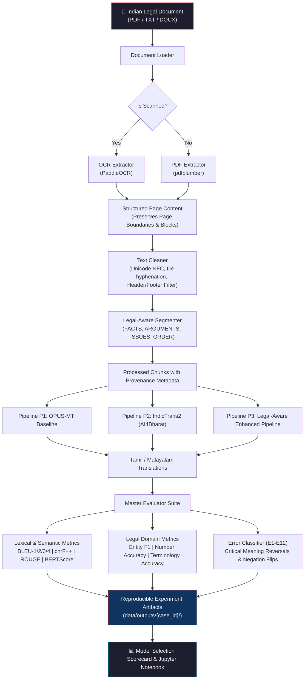
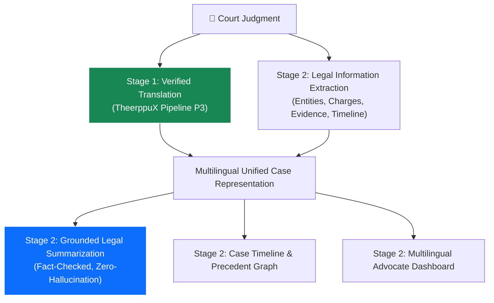

# TheerppuX — Multilingual Indian Legal Document Understanding & Translation Pipeline

> **Stage 1: Backend Multilingual Translation & Empirical Benchmark (Tamil `ta` & Malayalam `ml`)**

[](https://www.python.org/downloads/)
[](https://opensource.org/licenses/Apache-2.0)
[](https://pytorch.org/)
[](https://huggingface.co/)
[](https://github.com/AI4Bharat/IndicTrans2)

---

## 1. Problem Statement

Indian legal judgments—originating from High Courts and District Courts—are authored in English but govern citizens, advocates, and subordinate courts operating in regional vernaculars. In South India, especially across **Tamil Nadu** and **Kerala**, accurate translation into **Tamil (`ta`)** and **Malayalam (`ml`)** is critical.

However, legal translation has strict requirements that distinguish it from general machine translation:
* **Zero-Tolerance for Critical Entity Alterations:** A subtle distortion of statutory sections (*Section 302 IPC* [Murder] $\rightarrow$ *Section 304* [Culpable Homicide]), monetary values (*₹50,000* $\rightarrow$ *₹5,000*), or dates (*12-03-2021* $\rightarrow$ *12-03-2024*) fundamentally corrupts judicial meaning.
* **Agglutinative Morphology:** Tamil and Malayalam feature intricate nominal and verbal inflections, making standard word-level BLEU uninformative compared to character n-gram metrics (chrF++).
* **Legal Terminology Consistency:** Translating party roles (*appellant / petitioner / respondent*), judicial actions (*conviction / acquittal*), and procedural filings (*affidavit / cross-examination*) demands domain-faithful terminology mappings.

TheerppuX Stage 1 provides a **reproducible backend ML pipeline** to ingest court judgments, execute legal-aware segmentation, translate into Tamil or Malayalam across multiple model configurations, and evaluate translations using a domain-specific legal error taxonomy.

---

## 2. Stage-1 Scope

### In Scope
* Ingestion of digital and scanned Indian legal documents (**PDF**, **TXT**, **DOCX**).
* OCR extraction fallback for scanned documents (via PaddleOCR).
* Legal-aware text cleaning and structural segmentation (preserving headings like *FACTS*, *ARGUMENTS*, *ORDER*, *JUDGMENT*).
* Command-line driven translation into **Tamil (`--target ta`)** or **Malayalam (`--target ml`)**.
* Evaluation across **3 Model / Pipeline Configurations**:
  * **P1 (Baseline):** Helsinki-NLP OPUS-MT (`opus-mt-en-dra` / `opus-mt-en-ml`).
  * **P2 (IndicTrans2):** AI4Bharat IndicTrans2 (`indictrans2-en-indic-dist-200M`).
  * **P3 (Legal-Aware):** IndicTrans2 + Legal Entity Masking + Terminology Dictionary Validation + Post-translation Repair.
* Comprehensive evaluation suite:
  * Generic NMT: **BLEU-1/2/3/4**, **chrF / chrF++**, **ROUGE-1/2/L**, **BERTScore F1**.
  * Legal Domain: **Entity Preservation F1**, **Number/Monetary Accuracy**, **Legal Terminology Accuracy**.
  * Automated **Critical Error Classification (E1–E12)**.
* Cross-language consistency analysis between Tamil and Malayalam translations.
* Standardized human evaluation CSV generation and statistical analysis.
* Presentation-ready Jupyter evaluation notebook (`notebooks/stage1_model_evaluation.ipynb`).

### Out of Scope (Reserved for Future Stages)
* Frontend / Web UI (React, Streamlit, etc.)
* Chatbot / Conversational agents
* Legal advice or judgment outcome prediction
* Cloud database deployments and user authentication

---

## 3. Architecture



---

## 4. Installation & Environment Setup

### 1. Clone Repository & Create Conda Environment

```bash
git clone https://github.com/Tharan-J/TheerppuX.git
cd TheerppuX

# Create and activate conda environment with Python 3.11
conda create -n myenv python=3.11 -y
conda activate myenv
```

### 2. Install Dependencies

```bash
# Core ML, NLP, and evaluation packages
pip install -r requirements.txt

# Install IndicTransToolkit for AI4Bharat IndicTrans2 support
pip install IndicTransToolkit

# (Optional) For scanned PDF OCR support
pip install paddleocr paddlepaddle
```

### 3. Compute Device Compatibility
TheerppuX automatically detects and leverages the fastest available compute backend:
* **NVIDIA CUDA:** Auto-enabled with `fp16` precision for fast GPU batch inference.
* **Apple Silicon (MPS):** Auto-detected on macOS.
* **CPU:** Multi-threaded fallback with `fp32` precision.

---

## 5. Dataset Structure & Formats

```text
TheerppuX/
├── data/
│   ├── raw/                       # Source legal documents (.pdf, .txt, .docx)
│   │   ├── case_001.txt           # Demo Case 1: Criminal Appeal (Sec 302 IPC)
│   │   └── case_002.txt           # Demo Case 2: NI Act Dishonour (Sec 138 NI Act)
│   │
│   ├── references/                # Human-verified reference translations
│   │   ├── tamil/
│   │   │   ├── case_001.txt
│   │   │   └── case_002.txt
│   │   └── malayalam/
│   │       ├── case_001.txt
│   │       └── case_002.txt
│   │
│   └── outputs/                   # Reproducible experiment artifacts
│       └── case_001/
│           ├── extracted/
│           │   ├── pages.json     # Page-level provenance & block coordinates
│           │   └── full_text.txt
│           ├── chunks/
│           │   └── chunks.json    # Legal-aware segmented chunks
│           ├── translations/
│           │   ├── baseline_ta.json
│           │   ├── indictrans2_ta.json
│           │   └── legal_aware_ta.json
│           ├── evaluation/
│           │   ├── metrics.json   # Aggregated metric scores
│           │   ├── sentence_metrics.json
│           │   ├── error_analysis.json
│           │   └── human_evaluation_template.csv
│           └── experiment_metadata.json
```

---

## 6. CLI Usage & Commands

The pipeline is completely driven by command-line interfaces.

### A. Run Multi-Model Experiment (P1, P2, P3 Benchmark)

#### Tamil (`ta`):
```bash
python -m src.cli experiment \
    --input data/raw/case_001.txt \
    --target ta \
    --models baseline indictrans2 legal_aware
```

#### Malayalam (`ml`):
```bash
python -m src.cli experiment \
    --input data/raw/case_002.txt \
    --target ml \
    --models baseline indictrans2 legal_aware
```

---

### B. Run Single Document Translation

Translate a case directly using a specific model:

```bash
# English to Tamil using IndicTrans2
python -m src.cli translate \
    --input data/raw/case_001.txt \
    --target ta \
    --model indictrans2

# English to Malayalam using Legal-Aware Pipeline
python -m src.cli translate \
    --input data/raw/case_002.txt \
    --target ml \
    --model legal_aware
```

Direct module execution is also supported:
```bash
python -m src.pipeline --input data/raw/case_001.txt --target ta
```

---

### C. Evaluate Existing Predictions Against Ground Truth

```bash
python -m src.cli evaluate \
    --predictions data/outputs/case_001/translations/indictrans2_ta.json \
    --references data/references/tamil/case_001.txt \
    --source data/outputs/case_001/extracted/full_text.txt \
    --target ta
```

---

### D. Dataset Inspection Utility

```bash
python scripts/prepare_dataset.py --data-dir data
```

---

## 7. Legal Error Taxonomy (E1–E12)

TheerppuX classifies translation discrepancies into a formal 12-category legal error taxonomy categorized by severity:

| Code | Error Category | Severity | Description & Impact | Example |
| :--- | :--- | :--- | :--- | :--- |
| **E1** | Entity error | MAJOR | Named entity (judge, counsel, court, party) omitted or distorted | High Court of Madras $\rightarrow$ District Court |
| **E2** | Date error | **CRITICAL** | Occurrence, filing, or judgment date altered | 12-03-2021 $\rightarrow$ 12-03-2024 |
| **E3** | Number / Money error | **CRITICAL** | Monetary fine, compensation, or quantity distorted | ₹50,000 $\rightarrow$ ₹5,000 |
| **E4** | Legal-section error | **CRITICAL** | Statutory section or clause altered | Section 302 IPC $\rightarrow$ Section 304 IPC |
| **E5** | Negation error | **CRITICAL** | Dropped or inverted negation marker in finding | *not guilty* $\rightarrow$ *guilty* |
| **E6** | Party-role error | **CRITICAL** | Inversion of petitioner/appellant and respondent/state | *petitioner* $\rightarrow$ *respondent* |
| **E7** | Legal-term error | MAJOR | Incorrect or uncanonical legal terminology translation | *affidavit* $\rightarrow$ *general letter* |
| **E8** | Omission | MAJOR | Legally substantive clause omitted in target text | Dropping *in default to undergo 1 year RI* |
| **E9** | Addition / Hallucination | MAJOR | Unsubstantiated facts added to translated output | Fabricating non-existent witnesses |
| **E10** | Meaning reversal | **CRITICAL** | Reversal of operative judicial disposition | *convicted* $\rightarrow$ *acquitted*; *allowed* $\rightarrow$ *dismissed* |
| **E11** | Fluency error | MINOR | Unnatural syntax or disfluent regional phrasing | Word order awkwardness |
| **E12** | Formatting error | MINOR | Loss of section breaks, paragraph markers, or punctuation | Dropped numbered lists |

---

## 8. Quantitative Metrics Overview

| Metric | Target Dimension | Key Characteristic |
| :--- | :--- | :--- |
| **BLEU-1 to BLEU-4** | N-gram Precision | Measured using `sacrebleu` with `flores200` tokenization |
| **chrF / chrF++** | Morphological Overlap | Character & word n-grams; crucial for agglutinative Tamil & Malayalam |
| **ROUGE-1/2/L** | Lexical Recall | Supplementary metric (lexical overlap only) |
| **BERTScore F1** | Semantic Similarity | Multilingual contextual embeddings (`bert-base-multilingual-cased`) |
| **Entity Preservation F1** | Named Entity Recall | Evaluates preservation of Courts, Laws, Sections, Case Nos, and Dates |
| **Number Accuracy (%)** | Numerical Fidelity | Verifies exact integer, decimal, and currency preservation |
| **Legal Term Accuracy (%)** | Domain Terminology | Checks against configurable Tamil/Malayalam legal dictionaries |
| **Critical Error Rate (%)** | Risk Rate | Percentage of chunks containing **CRITICAL** severity errors |

---

## 9. Interactive Evaluation Notebook

To explore comparative charts, error distributions, and scorecard rankings interactively:

```bash
jupyter notebook notebooks/stage1_model_evaluation.ipynb
```

The notebook contains 8 interactive sections:
1. **Experiment Objective & Narrative**
2. **Dataset Characterization & Word Counts**
3. **Model & Pipeline Architectures ($P1, P2, P3$)**
4. **Automatic Metrics Visualizations (Bar & Radar Charts)**
5. **Qualitative Error Analysis (Side-by-side comparative views)**
6. **Case-Level Granular Breakdown**
7. **Tamil vs Malayalam Performance & Cross-Language Consistency**
8. **Configurable Multi-Criteria Decision Scorecard**
9. **Human Evaluation Statistics (Mean, Median, Inter-rater agreement)**

---

## 10. Future Compatibility: Roadmap to Stage 2

Stage 1 establishes the translation foundation. Stage 2 will extend this architecture without breaking existing APIs:



---

## 11. Ethical & Privacy Considerations

* **Synthetic Demo Data:** All demo documents are synthetic and clearly marked: `DEMO DATA — NOT AN ACTUAL COURT RECORD`.
* **No Legal Advice:** TheerppuX is an ML research translation pipeline. It does not provide legal advice or predict judicial outcomes.
* **Empirical Integrity:** If ground-truth human reference translations are absent, reference-based metrics (BLEU, chrF) are honestly reported as unavailable rather than fabricated.

---

## 12. License

Apache License 2.0. Developed as part of TheerppuX Stage 1.
